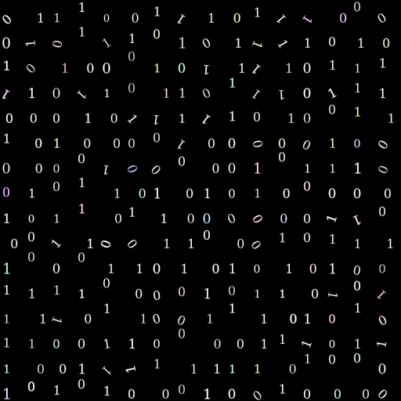
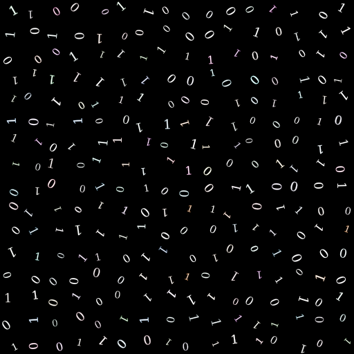
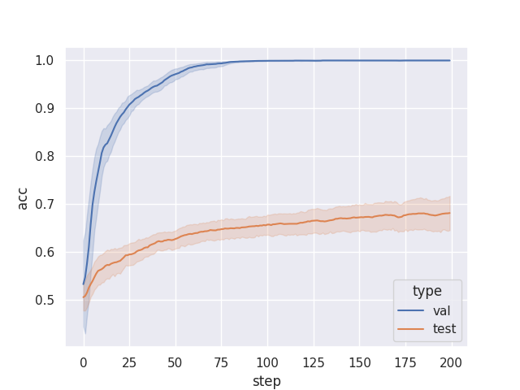

[![CC BY 4.0][cc-by-shield]][cc-by]


# DynamicPrint


This repo is a work in progress character random animation generator. It is mainly aimed for deep learning research. 

Currently it offers a few basic features : 
- Generate a random character animation with configurable timeline
    - Random number of animations in certain range
    - Random duration in certain range
    - Random overlap in certain range
    - Random attribute values in certain ranges
- Current animatable attributes:
    - Position
    - Rotation
    - Scale
    - Color
    - Opacity
    - Stroke width/color/opacity
- Multiprocessing support
- Basic metadata generation 
    - Generates a metadata file for the dataset, with label and group information
- Generating from different distributions 

### Installation

To use this package, you can either create a conda environment as follows

```bash
conda create -f environment.yml
```

Which will create a new environment called `dynamicprint`. Or install the required packages via pip

```bash
pip install -r requirements.txt	
```

### Usage

Currently, you can generate a toy dataset with the following command

```bash
python src/dynamicprint.py 
```

Which will create a `data` folder with subfolders depending on the date and time of the run.
You can then train a basic neural network on this dataset with the following command

```bash
python src/erm_baseline.py <DATASET_PATH> 
```
Which will train a simple 2 layer CNN on the data in the `<DATASET_PATH>` folder.

### Basic results

The toy dataset generated by default coresponds to the following train and validation distribution.
A set of videos are generated as follows :
A character is randomly selected between 0 and 1 and is put in the bottom left of the video.
Then we apply **only one** of the following transformations :
- Translation x : random between 0 and 4 units
- Translation y : random between 0 and 4 units
- Rotation : random between 0 and 2𝜋
- Scaling : random between 0.8 and 1.2

Train/val sample : 

For the test set, we do the same thing, except we allow **all** of the above transformations.

Test sample : 

We get the following results for the ERM baseline




This work is licensed under a
[Creative Commons Attribution 4.0 International License][cc-by].

[![CC BY 4.0][cc-by-image]][cc-by]

[cc-by]: http://creativecommons.org/licenses/by/4.0/
[cc-by-image]: https://i.creativecommons.org/l/by/4.0/88x31.png
[cc-by-shield]: https://img.shields.io/badge/License-CC%20BY%204.0-lightgrey.svg